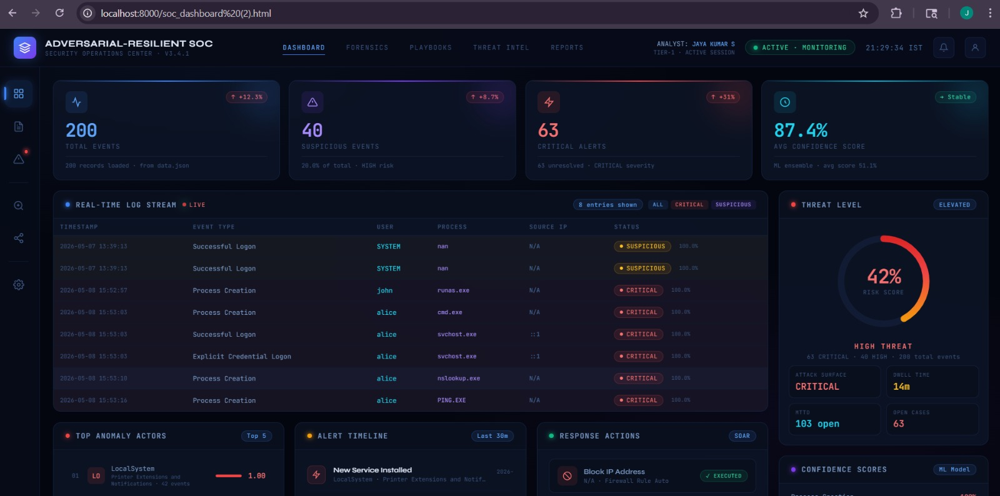
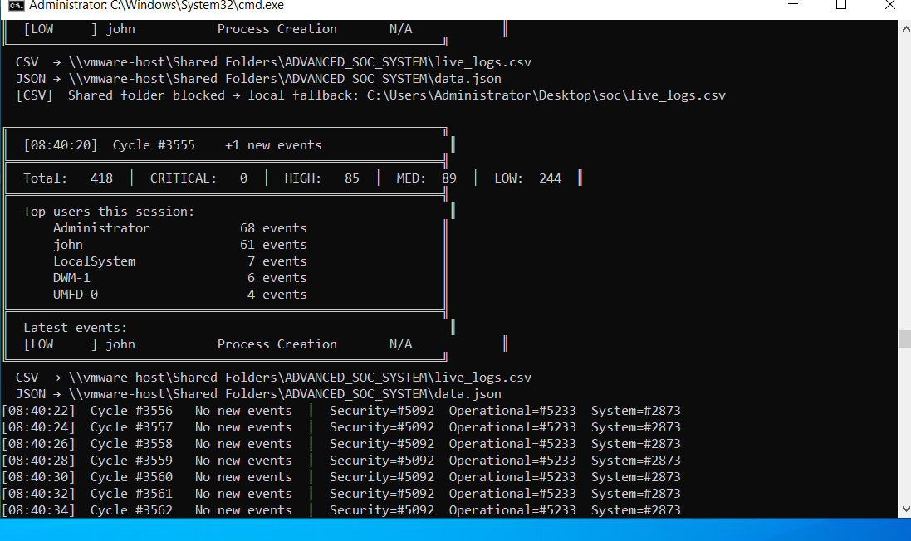
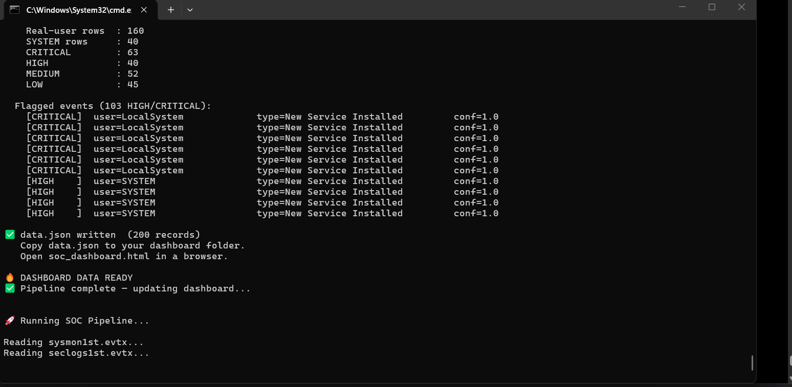

# Autonomous Blue Team Defense System using Adversarial-Resilient Machine Learning for SOC Automation

## Overview

This project presents an AI-driven Security Operations Center (SOC) automation system designed to improve threat detection, reduce analyst workload, and automate security monitoring workflows.

The system collects and processes Windows security logs, applies machine learning techniques for anomaly detection, assigns confidence-based threat scores, and visualizes incidents through a SOC dashboard.

The project focuses on building a resilient Blue Team defense system capable of identifying suspicious behavior patterns and stealthy attack techniques that may bypass traditional rule-based security systems.

---

## Problem Statement

Modern cyber attackers use advanced evasion techniques such as:

- Living-off-the-land attacks
- Low-and-slow persistence
- Encrypted command-and-control communication
- Insider-like behavior patterns
- Stealthy process execution

Traditional security monitoring systems often struggle to detect these activities due to:

- Alert fatigue
- High false-positive rates
- Manual log investigation
- Delayed incident response
- Lack of intelligent threat prioritization

This project aims to automate SOC operations using machine learning, behavioral analytics, and intelligent detection workflows.

---

## Objectives

- Automate SOC monitoring workflows
- Process and analyze Windows event logs
- Detect anomalous system behavior using machine learning
- Reduce false positives using ensemble detection
- Prioritize incidents using confidence scoring
- Visualize threats through a centralized dashboard
- Improve resilience against adversarial attack techniques

---

## Key Features

- Multi-source log collection
- Security log preprocessing
- Feature engineering pipeline
- Isolation Forest-based anomaly detection
- Ensemble detection engine
- Confidence-based threat scoring
- Automated alert generation
- SOC dashboard visualization
- Behavioral analytics workflow
- Adversarial-resilient detection techniques

---

## Technologies Used

### Programming & Development
- Python
- HTML
- JSON
- CSV Processing

### Machine Learning
- Isolation Forest
- Behavioral Analytics
- Ensemble Detection

### Cybersecurity Concepts
- SOC Automation
- Blue Team Operations
- Threat Detection
- Security Event Monitoring
- Log Analysis
- Confidence Scoring
- Adversarial Machine Learning

### Log Sources
- Windows Event Logs
- Security Logs
- Sysmon Logs
- Process Activity Logs

---

## Project Workflow

1. Collect logs from Windows event sources
2. Convert raw logs into structured format
3. Preprocess and normalize security logs
4. Extract important behavioral features
5. Apply anomaly detection models
6. Generate alerts based on suspicious activity
7. Assign confidence scores to incidents
8. Visualize alerts and activity in SOC dashboard

---

## Project Structure

```text
AI-Driven-SOC-Automation/
│
├── scripts/          # Processing and ML scripts
├── data/             # CSV, JSON, and processed outputs
├── images/           # Dashboard and workflow screenshots
├── app.py
├── README.md
└── requirements.txt
```

---

## Screenshots

### SOC Dashboard



---

### Logs and Detection Output



---

### Threat Detection Pipeline



---

## Detection Techniques Used

### Anomaly Detection
Isolation Forest is used to identify unusual activity patterns and suspicious behaviors within system logs.

### Ensemble Detection
The system combines rule-based logic and machine learning predictions to improve detection accuracy and reduce false positives.

### Behavioral Analytics
Behavioral monitoring is used to identify stealthy attack patterns and abnormal activities.

### Confidence Scoring
Detected threats are categorized into:
- Low Risk
- Medium Risk
- High Risk

based on detection confidence levels.

---

## Dashboard Functionality

The SOC dashboard provides visibility into:

- Security alerts
- Threat confidence levels
- Log monitoring
- Detection results
- Suspicious process activity
- Incident prioritization

---

## Future Enhancements

- SIEM platform integration
- Real-time streaming pipeline
- Threat intelligence feed integration
- Deep learning-based threat detection
- Cloud deployment
- Automated incident response orchestration
- Advanced adversarial defense techniques

---

## Learning Outcomes

Through this project, I gained practical exposure to:

- SOC operations and workflows
- Security log analysis
- Threat detection methodologies
- Machine learning in cybersecurity
- Adversarial ML concepts
- Feature engineering
- Dashboard visualization
- Security automation pipelines

---

## References

- Biggio & Roli — Adversarial Machine Learning
- Papernot — Black-box attacks against ML
- Demontis — Transferability of adversarial attacks
- Barreno — Security of machine learning systems

---

## Author

### Jayakumar S

MCA Graduate | Cybersecurity Enthusiast | SOC Automation & AI Security Learner

Focused on:
- Blue Teaming
- SOC Operations
- Threat Detection
- Security Automation
- AI in Cybersecurity
